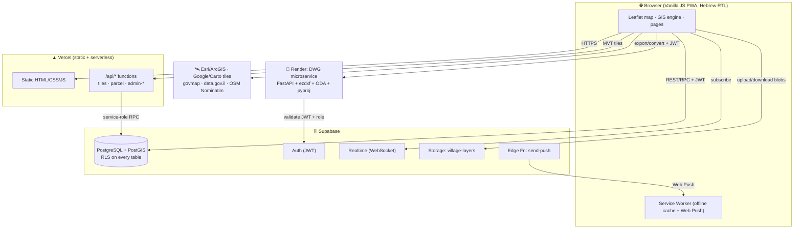
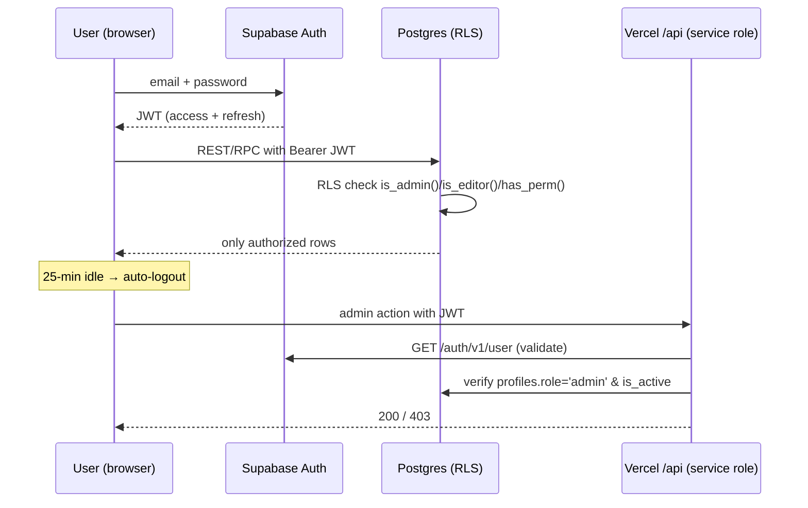
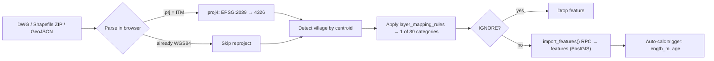
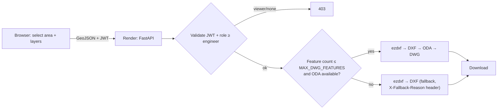

<div align="center">

# 💧 Mei HaGalil GIS

### Web GIS for managing the water & sewage infrastructure of a multi-village water utility
### מערכת GIS לניהול תשתיות מים וביוב עבור תאגיד מים רב-יישובי

[](https://mei-hagalil-gis.vercel.app)
[]()
[]()
[]()
[]()
[]()

**🇬🇧 [English](#-overview) · 🇮🇱 [עברית](#-עברית--סקירה-בעברית)**

</div>

---

<a id="-עברית--סקירה-בעברית"></a>
<div dir="rtl" align="right">

## 🇮🇱 עברית — סקירה בעברית

**מי הגליל GIS** היא מערכת web לניהול, עריכה ושיתוף של מפות תשתית המים והביוב של תאגיד המים — שבעה יישובים בצפון הארץ. המערכת מאפשרת לצוותי ההנדסה והתחזוקה לנהל תקלות בזמן אמת, להציג ולערוך שכבות תשתית שמקורן בקבצי **DWG / DXF / Shapefile / GeoJSON / KML / KMZ / CSV**, לחבר את שכבות הרשת למוני המים של **ארד (Arad)**, ולייצא נתונים לפורמטים הסטנדרטיים בענף — **DXF/DWG (AutoCAD), Shapefile, GeoJSON, KML ו-CSV/Excel**.

המערכת בנויה ב-**JavaScript טהור ללא שלב build**, מעל **Supabase (PostgreSQL + PostGIS)**, מתארחת ב-**Vercel**, ונעזרת ב-**מיקרו-שירות המרת DWG על Render**. כל הממשק בעברית עם תמיכת **RTL** מלאה ונגישות **WCAG 2.1 AA**.

### פיצ'רים עיקריים

- **מפה אינטראקטיבית** — Leaflet, ארבעה רקעי מפה (Google לוויין/היברידי/רחובות, CartoDB), זום עד רמה 20, **30 קטגוריות שכבות**, שכבת קדסטרה (ממ"ג / data.gov.il) לחיפוש גוש-חלקה, כלי מדידה, חיפוש לפי כתובת/קואורדינטה.
- **ניהול תקלות בזמן אמת** — פתיחה ממוקמת גאוגרפית, שלוש רמות עדיפות, workflow (פתוחה → בטיפול → סגורה), שיוך מטפל, עדכוני **Supabase Realtime**, ויומן ביקורת עם מדידת זמן טיפול.
- **הרשאות תלת-שכבתיות (RBAC)** — `viewer` (דיווח שטח/צפייה) · `engineer` (עריכה + אישור) · `admin` (ניהול מלא).
- **העלאת שכבות חכמה** — GeoJSON/JSON, Shapefile ZIP, DWG, DXF, KML/KMZ ו-CSV (עם מיפוי עמודות אוטומטי/ידני, כולל זיהוי עמודת WKT), זיהוי יישוב אוטומטי, פיצול לרב-יישובי, מיפוי שכבות AutoCAD לפי חוקים, והמרת **ITM (EPSG:2039) → WGS84** אוטומטית.
- **מנוע GIS** — עריכת אובייקטים (יצירה/עדכון/מחיקה) עם **בטל/בצע שוב**, טבלת מאפיינים עם **דפדוף בצד השרת + עריכה מרובה + ייצוא CSV**, סנכרון **בזמן אמת** בין המפה לטבלה, שדות מחושבים (ללא `eval`), שאילתות מסוננות, וניתוח מרחבי.
- **אינטגרציית מוני מים (ארד)** — ייבוא CSV/JSON עם מיפוי כותרות עבריות, קישור מונה-לאובייקט, וזיהוי חריגות צריכה.
- **יצוא ל-DXF/DWG/Shapefile/GeoJSON/KML/CSV/Excel** (כולל תקציר שטח-ייצוא וטור WKT אופציונלי), **התראות Web Push**, ו-**PWA** הניתן להתקנה ועובד גם במצב לא-מקוון.

### היישובים הנתמכים

| יישוב | Slug | קואורדינטות |
|---|---|---|
| מגד אל-כרום | `majd` | 32.9189°N, 35.2456°E |
| בענה | `biina` | 32.9485°N, 35.2617°E |
| דיר אל-אסד | `deir_al_asad` | 32.9356°N, 35.2697°E |
| נחף | `nahf` | 32.9344°N, 35.3025°E |
| סחנין | `sakhnin` | 32.8650°N, 35.2978°E |
| דיר חנא | `deir_hanna` | 32.8631°N, 35.3589°E |
| עראבה | `arrabeh` | 32.8514°N, 35.3339°E |

➡️ **התיעוד הטכני המלא (ארכיטקטורה, API, סכמה, פריסה) מופיע באנגלית בהמשך — [לתיעוד באנגלית](#-overview).**

</div>

---

<a id="-overview"></a>

## 📋 Table of Contents

1. [Overview](#-overview-1)
2. [Features](#-features)
3. [Technology Stack](#-technology-stack)
4. [Architecture](#-architecture)
5. [Project Structure](#-project-structure)
6. [Installation](#-installation)
7. [Environment Variables](#-environment-variables)
8. [Database](#-database)
9. [API Documentation](#-api-documentation)
10. [Security](#-security)
11. [Performance](#-performance)
12. [Deployment](#-deployment)
13. [Third-Party Services](#-third-party-services)
14. [Monitoring & Logging](#-monitoring--logging)
15. [Testing](#-testing)
16. [CI/CD](#-cicd)
17. [Roadmap](#-roadmap)
18. [Troubleshooting](#-troubleshooting)
19. [Architecture Strengths & Technical Debt](#-architecture-strengths--technical-debt)
20. [Contributing](#-contributing) · [License](#-license) · [Author](#-author)

---

## 🌊 Overview

**Mei HaGalil GIS** is a production web GIS that lets a municipal water utility manage the water and
sewage networks of **seven villages** in northern Israel from a single browser-based map.

### What the platform does
It ingests engineering CAD/GIS data (DWG, Shapefile, GeoJSON), classifies it into 30 infrastructure
categories, renders it on a fast vector-tile map, and layers an operational workflow on top:
real-time incident management, role-based field reporting and review, water-meter (Arad) integration,
and standards-compliant export back to DWG/DXF for engineers.

### Who it is built for
- **Utility operators & dispatchers** — track and triage network faults in real time.
- **GIS / engineering teams** — maintain the authoritative spatial dataset; edit features and attributes; export to AutoCAD.
- **Field technicians** — submit geo-tagged observations from a phone (installable PWA, offline-capable).
- **Management** — a live, single-pane view of network state and incident throughput.

### The business problem it solves
Water utilities typically keep their network "truth" locked inside desktop AutoCAD/QGIS files on a
few engineers' machines, disconnected from day-to-day operations. Field faults are tracked in
spreadsheets or phone calls; meter data lives in a separate vendor system. **Mei HaGalil GIS unifies
all of it** — the spatial network, the operational incident queue, and the meter consumption data —
in one continuously-deployed, low-cost, mobile-friendly web app, with a full audit trail.

### Main use cases
- Upload a village's CAD export and have it auto-classified, re-projected, and live on the map in minutes.
- Open, assign, and close a network incident with geo-location and a measured time-to-resolution.
- Let a field viewer submit an observation; an engineer reviews and promotes it to a production feature.
- Link Arad meters to network features and flag abnormal consumption.
- Export a selected area back to DXF for the engineering team's AutoCAD workflow.

### Key benefits
- **One source of truth** for the network, operations, and meters.
- **Near-zero infrastructure cost** — runs on the free/low tiers of Supabase, Vercel, and Render.
- **Zero build step** — plain HTML/CSS/JS deployed straight to a CDN; trivial to maintain and audit.
- **Secure by construction** — JWT auth, Postgres Row-Level Security on every table, a strict CSP, and an append-only audit log.
- **Hebrew-first, RTL, accessible, installable** — built for the people who actually operate the network.

---

## ✨ Features

### 🗺️ Interactive Map
- **Leaflet 1.9.4** engine with 4 basemaps: Google Satellite HD, Google Hybrid, Google Streets, CartoDB Light.
- Zoom to level 20; live cursor coordinate readout.
- **30 layer categories** (water pipes, meters, hydrants, valves, reservoirs, pump stations, sewage pipes/manholes, fittings, annotations, parcels, buildings…).
- **Cadastre layer** with live gush/helka (block/parcel) lookup via the Israeli open-data registry.
- **Marker clustering** (Leaflet MarkerCluster) for dense point layers.
- **Measure tools** — line length and polygon area.
- **Search** by coordinate or address (ArcGIS Geocoder with OpenStreetMap Nominatim fallback).
- **Bookmarks** (saved map extents), click-to-identify, and an ArcGIS-Pro-style ribbon toolbar.

### 🔐 Authentication & RBAC
- **Supabase Auth** (email/password, JWT). Sign-ups are invite-only (admin-created).
- **Three-tier role model:**

  | Role | Field submit | Review submissions | Edit GIS / meters | Manage layers / schema / users |
  |---|:---:|:---:|:---:|:---:|
  | `viewer` | ✅ | ❌ | ❌ | ❌ |
  | `engineer` | ✅ | ✅ | ✅ | ❌ |
  | `admin` | ✅ | ✅ | ✅ | ✅ |

- Email-based password reset; **25-minute idle auto-logout** with a 60-second warning.

### 🚨 Incident Management
- Geo-tagged incidents with three priorities (high/medium/low) and a full workflow (open → in_progress → closed).
- Assignment to specific handlers; **time-to-close** measured automatically.
- **Real-time** propagation via Supabase Realtime — every connected client sees new incidents instantly.
- Append-only **incident log** capturing who did what, when.

### 📥 Smart Layer Upload
- **Seven input formats**, up to 100 MB: **GeoJSON/JSON**, **Shapefile ZIP** (`.shp/.dbf/.prj` auto-detected), **DWG**, **DXF**, **KML**, **KMZ**, and **CSV** (column-mapping step; lon/lat *or* a WKT column, auto-guessed from header names).
- **Automatic CRS detection + transform** — ITM (EPSG:2039) → WGS84 (EPSG:4326) via a single canonical proj4 definition (`js/crs-utils.js`, `CRSUtils`).
- **Automatic village detection** by feature centroid; **auto-split** of multi-village files.
- **Layer mapping rules** classify AutoCAD layer names into the 30 categories (contains / exact / starts_with / regex, with priority), and newly-learned rules are saved.
- A dedicated **import pipeline** (`js/import-pipeline.js` + one parser per format under `js/importers/`) runs parse → validate → reproject → map-to-layers → commit as independently-testable stages.

### 🧰 GIS Engine (editing & analysis)
- Feature **create / update / delete** with on-map geometry drawing (Leaflet-Geoman), backed by a bounded **undo/redo** stack (50 deep) that reverses create/delete/geometry edits.
- **Attribute table** with **server-side pagination** (`features_page` / `features_page_count` RPCs — only one page is ever held in memory, even for 18k+-feature layers), search/sort/filter, **bulk edit** across a multi-row selection, and a page-by-page **CSV export** (capped at 20,000 rows).
- **Realtime map ↔ table sync** (`window.GISRealtime`) — scoped, ref-counted Supabase Realtime channels per watched layer (capped at 2 concurrent), with the editing client's own writes suppressed so a save doesn't trigger a redundant self-refresh.
- **Layer picker** with live **search** (by village or category name) and per-village **drag-to-reorder**.
- **Calculated fields** evaluated by a **safe tokenized expression engine — no `eval`**.
- **SQL-like filtering** with whitelisted operators and regex-checked field names (no injection surface).
- **Spatial helpers** — geodesic length, haversine distance, within-radius, buffer/intersect (Turf.js).
- **Auto-calc triggers** in Postgres compute `length_m` for lines and `age` from `install_year` on write.

### 🔢 Water-Meter (Arad) Integration
- Import meter CSV/JSON with **Hebrew column-header mapping** (noise-tolerant: geresh/gershayim, bidi marks, NBSP).
- Link meters to features by `asset_code`, `customer_id`, or 25 m spatial proximity.
- **Anomaly detection** (consumption > 1.5× average) via a database view.

### 📝 Field-Submission Workflow
- Viewers capture geo-tagged observations (GPS + camera) from the installable PWA.
- Engineers/admins **review, approve (promote to feature), or reject** in a dedicated Review Center.
- Viewer↔engineer assignments route submissions to the right reviewer.

### 📤 Export
- Draw an export area (or use a feature selection), filter by category, and export to **DXF**, **DWG**, **Shapefile** (ZIP, ITM-projected `.prj`), **GeoJSON**, **KML**, **CSV**, or **Excel** (XLSX).
- **DXF** is built **entirely client-side** (lightweight R12/AC1009 text, no server round-trip). **DWG** round-trips through the Render service, which builds a full **R2018 DXF** (ezdxf) and converts it via ODA — if ODA is unavailable or the selection exceeds the feature cap, the server-generated R2018 DXF is downloaded instead (`X-Fallback-Reason` header).
- An **export-area summary** (`export_area_summary` RPC) previews a per-layer feature count + geometry-type breakdown for the drawn rectangle **before** running the real export.
- Optional **WKT column** (CSV/Excel) embeds full geometry as Well-Known Text alongside the flattened attributes.
- Large exports (DXF/CSV/KML/Shapefile-prep) are built in **chunked async batches** so the tab doesn't freeze on big selections.

### 🔔 Notifications
- In-app **realtime notification bell** + toasts.
- **Web Push** (VAPID) via a Supabase Edge Function for background/offline delivery.

### 🛡️ Security · ⚡ Performance · 🌍 Localization
- Row-Level Security on every table; strict CSP/HSTS headers; per-IP rate limiting; SRI-pinned CDN scripts.
- Edge-cached vector tiles, viewport (bbox) lazy-loading, clustering, and a zero-build static frontend.
- **Hebrew-first, full RTL**, Rubik font, **WCAG 2.1 AA** accessibility, and a **mobile-responsive, installable PWA**.

---

## 🧱 Technology Stack

### Frontend
| Technology | Version | Why it was chosen |
|---|---|---|
| Vanilla JavaScript (ES6+) + HTML5 + CSS3 | — | **Zero build step** — no bundler, no transpiler. Trivial to deploy, audit, and hand off; nothing to break in a toolchain. |
| Leaflet | 1.9.4 | Lightweight, battle-tested mapping engine; huge plugin ecosystem; far lighter than a full GL stack for this dataset. |
| Leaflet MarkerCluster | 1.5.3 | Keeps dense point layers (meters, fittings) performant. |
| Leaflet-Geoman | 2.18.3 | On-map drawing/editing of point/line/polygon geometry. |
| proj4.js | — | Client-side ITM (EPSG:2039) ↔ WGS84 reprojection of uploaded Shapefiles. |
| shapefile.js + JSZip | — | Parse Shapefile ZIPs entirely in the browser — no server round-trip for upload. |
| Turf.js | 7 (optional) | Buffer/intersect spatial analysis when needed. |
| Google Fonts — Rubik | — | Hebrew-optimized typeface with proper kerning. |

### Backend / Hosting
| Technology | Why |
|---|---|
| Vercel Serverless Functions (Node 24) | Static hosting + serverless `/api/*` on the same domain, auto-deploy from Git, global edge cache. |
| Render (Docker) | Hosts the Python DWG microservice (needs a native ODA binary + xvfb that Vercel can't run). |

### Database
| Technology | Why |
|---|---|
| Supabase **PostgreSQL + PostGIS** | Managed Postgres with first-class geospatial: geometry columns, GIST indexes, vector-tile generation, all in SQL. |
| Storage in EPSG:4326 (WGS84); GIST + GIN indexes | Web-standard CRS; fast spatial and JSONB attribute queries. |

### Authentication
| Technology | Why |
|---|---|
| Supabase Auth (JWT) + **Row-Level Security** | Authorization lives in the database, not just the UI — every read/write is policy-checked regardless of client. |

### Payments
Not applicable — this is an internal utility platform, not a paid SaaS (no billing module).

### Storage
| Technology | Why |
|---|---|
| Supabase Storage (`village-layers` bucket) | Holds uploaded GeoJSON blobs; metadata tracked in `village_layers`. |

### AI Services
None. The "smart" upload/classification is rule-based (layer mapping rules), not ML.

### Conversion Microservice
| Technology | Version | Why |
|---|---|---|
| FastAPI | 0.115.6 | Small, fast, typed Python API. |
| Uvicorn | 0.30.1 | ASGI server. |
| **ezdxf** | 1.3.4 | Generates and parses DXF (AutoCAD) from/to GeoJSON. |
| **ODA File Converter** | binary | DXF ↔ DWG conversion (installed via `.deb` in the Docker image, run headless under xvfb). |
| pyproj | 3.6.1 | EPSG:2039 ↔ 4326 transforms server-side. |
| PyJWT | 2.9.0 | Legacy local JWT fallback (primary auth is remote Supabase validation). |

### Deployment / Infrastructure
Vercel (frontend + API) · Render (DWG service) · Supabase (DB, Auth, Storage, Realtime, Edge Functions) · GitHub Actions (CI) · optional Vercel KV / Upstash Redis (rate limiting).

### Monitoring
Sentry (browser error tracking, DSN-gated/optional) · Render `/health` healthcheck · Supabase & Vercel built-in dashboards.

### Analytics
No third-party product analytics; operational metrics derive from `incident_logs` / `audit_log` and Vercel/Supabase dashboards.

---

## 🏗️ Architecture

### High-level system context



### Authentication & authorization flow



### Upload → classify → reproject → store pipeline



### DWG export / conversion flow



**Splitting oversized DWGs.** DWGs larger than the server can convert (they OOM the ODA child
on the 512 MB free tier) can be split into smaller valid DWG parts at the CAD-entity level —
coordinates preserved, parts merge back into the same layers on import. Run it locally where
ODA has full RAM:

```bash
cd dwg-export
docker compose run --rm dwg-export \
  python -m dwg_splitter split /data/city.dwg --out /data/city_parts --max-mb 2.5
```

See [`dwg-export/DWG_SPLITTER_ARCHITECTURE.md`](dwg-export/DWG_SPLITTER_ARCHITECTURE.md) for the
full design, technology decision, strategies, and CLI reference.

**Component structure.** The frontend is ~40 small, single-purpose modules under `js/` (each owns one
feature: editing, table, identify, notifications, push, routing, symbology, print, geocode…), a reusable
**GIS engine** namespace under `gis-engine/` (`core`, `layers`, `features`, `fields`, `calculator`,
`queries`, `spatial`, `meters`, `villages`), and per-page controllers under `js/pages/`.

**API structure.** Thin Vercel serverless functions wrap privileged operations (tiles, cadastre,
admin user CRUD) with a service-role key; everything else is direct Supabase REST/RPC governed by RLS.

**Database design.** Two layers: the original operational schema (`db/schema.sql` — profiles,
incidents, logs, village layers, mapping rules) and the GIS engine schema (`gis-engine/sql/` — layers,
features, fields, meters), plus the field-workflow extension (`db/field-workflow.sql` — permissions,
assignments, audit log, notifications, push subscriptions). Geometry is `GEOMETRY(…, 4326)` with GIST
indexes; attributes are JSONB with GIN indexes.

**Storage strategy.** Large GeoJSON blobs live in Supabase Storage; the DB keeps only metadata. Vector
tiles are generated on demand by PostGIS and edge-cached at Vercel.

**Security architecture.** Defense in depth — JWT at the edge, RLS in the database, service-role keys
only on the server, a strict CSP, per-IP rate limiting, and append-only audit/incident logs.

---

## 📂 Project Structure

```text
mei-hagalil-gis/
├── index.html                 # Main interactive map (app entry point)
├── sw.js                      # Service Worker (PWA offline cache + Web Push)
├── manifest.webmanifest       # PWA manifest (Hebrew, RTL, installable)
│
├── pages/                     # Auth-gated static pages
│   ├── login.html / reset.html        # Auth + password reset
│   ├── admin.html                     # User management (admin)
│   ├── upload.html                    # Smart layer upload (admin)
│   ├── layer-rules.html               # AutoCAD layer mapping rules (admin)
│   ├── logs.html / gis-logs.html      # Activity & audit logs (admin)
│   ├── review.html                    # Field-submission review (engineer+)
│   └── gis-meters-import.html         # Arad meter import (admin)
│
├── css/
│   ├── shared.css             # Design tokens, RTL, components, motion
│   └── pages/                 # Per-page styles (incl. arcgis-pro.css ribbon)
│
├── js/                        # ~45 single-purpose feature modules
│   ├── auth.js                # Supabase client + profile + 25-min idle timer
│   ├── backend-client.js      # DWG/DXF export client (calls Render, JWT)
│   ├── export-feature.js + export-formats.js   # Export wizard + format builders
│   │                          #   (DXF/DWG/Shapefile/GeoJSON/KML/CSV/Excel)
│   ├── import-pipeline.js     # parse → validate → reproject → map → commit
│   ├── importers/             # one parser per format: geojson, shapefile, dwg, kml, csv
│   ├── crs-utils.js           # canonical EPSG:2039 (ITM) ⇄ WGS84 proj4 def + helpers
│   ├── layer-naming.js        # "<village> · <category>" layer-name compose/parse
│   ├── gis-realtime.js        # Realtime map↔table sync (window.GISRealtime)
│   ├── monitoring.js          # Sentry (optional), a11y.js, pwa.js
│   ├── gis-*.js               # edit (+ undo/redo), attribute-panel, feature-table,
│   │                          #   identify, notifications, push, routing, symbology,
│   │                          #   bookmarks, print, geocode-assist, meter-connect…
│   ├── arcgis-ribbon.js       # ArcGIS-Pro-style toolbar
│   └── pages/                 # Per-page controllers (index.js ≈ 1,100 LOC, upload.js ≈ 800 LOC)
│
├── gis-engine/                # Reusable GIS "brain" (no eval, RLS-aware)
│   ├── core.js                # GIS namespace, Supabase resolver, roles/permissions
│   ├── layers.js features.js fields.js
│   ├── calculator.js          # safe tokenized expression evaluator
│   ├── queries.js             # SQL-like filter → whitelisted structured query
│   ├── spatial.js meters.js villages.js
│   ├── README.md              # Engine API reference
│   └── sql/                   # schema.sql, mvt.sql, editing.sql, meter_connect.sql,
│                              #   audit.sql, domains.sql, tasks.sql, push.sql…
│       └── migrations/        # dated, idempotent follow-up migrations (see Database ▸ Migrations)
│
├── api/                       # Vercel serverless functions
│   ├── tiles.js               # GET MVT proxy (PostGIS → Mapbox Vector Tiles)
│   ├── parcel.js              # GET cadastre (gush/helka) via data.gov.il
│   ├── admin-create-user.js   # POST create user (admin only)
│   ├── admin-delete-user.js   # POST delete user (admin only)
│   ├── _authcheck.js          # requireActiveAdmin() guard
│   └── _ratelimit.js          # per-IP fixed-window limiter (Vercel KV / Upstash)
│
├── db/                        # Operational schema (apply in Supabase SQL editor)
│   ├── schema.sql             # profiles, incidents, incident_logs, village_layers,
│   │                          #   layer_mapping_rules, infrastructure + RLS + triggers
│   ├── field-workflow.sql     # role_permissions, assignments, audit_log, notifications, push
│   └── seed.sample.sql
│
├── dwg-export/                # Python DWG microservice (Render, Docker)
│   ├── main.py                # FastAPI app: export/convert endpoints + JWT auth
│   ├── dxf_builder.py         # GeoJSON → DXF (ezdxf)
│   ├── dxf_to_geojson.py      # DXF/DWG → GeoJSON
│   ├── requirements.txt  Dockerfile  .env.example
│   └── tests/                 # pytest (auth/role enforcement)
│
├── supabase/functions/send-push/   # Edge Function: Web Push (VAPID)
├── test/                      # Vitest unit tests (api/, gis-engine/)
├── tests/e2e/                 # Playwright smoke + RBAC specs
├── Data/                      # Sample Shapefiles (Hebrew village names)
├── .github/workflows/         # ci.yml, e2e.yml (+ dependabot.yml)
├── vercel.json  render.yaml   # Deploy config (headers/cache · Render service)
├── playwright.config.js  vitest.config.mjs  package.json
└── README.md  AUDIT.md  EXECUTION-ROADMAP.md  HANDOFF.md  DR.md
```

---

## ⚙️ Installation

### Prerequisites
- A free **[Supabase](https://supabase.com/)** project (PostgreSQL + PostGIS).
- A free **[Vercel](https://vercel.com/)** account (frontend + serverless API).
- A free **[Render](https://render.com/)** account (only if you need DWG↔DXF conversion).
- **Node.js 24.x** (for running the tests locally; the app itself needs no build).
- **Git** and a GitHub account.

### Clone the repository
```bash
git clone https://github.com/<your-username>/mei-hagalil-gis.git
cd mei-hagalil-gis
```

### Install dependencies (dev/test only — the app has no runtime npm deps)
```bash
npm install          # installs Vitest
```

### Configure the database (Supabase → SQL Editor, run in order)
```text
1) db/schema.sql                  # base tables, RLS, triggers, is_admin()/is_editor()
2) gis-engine/sql/schema.sql      # layers, features, fields, meters + RPCs (extends roles)
3) db/field-workflow.sql          # permissions, assignments, audit_log, notifications, push
4) gis-engine/sql/mvt.sql         # features_mvt() vector-tile RPC
5) gis-engine/sql/meter_connect.sql  # meter linking + anomaly view
```
Then:
- **Storage** → create a **public** bucket named `village-layers`.
- **Authentication → Providers → Email** → disable "Confirm email" (invite-only flow).
- Create your first user under **Authentication → Users**, then promote it:
  ```sql
  UPDATE profiles SET role = 'admin' WHERE email = 'you@example.com';
  ```

### Configure the frontend Supabase client
Edit `js/auth.js`:
```javascript
var SUPABASE_URL  = 'https://<your-project>.supabase.co';
var SUPABASE_ANON = '<your-anon-key>';
```

### Run the development server
The frontend is fully static — serve the folder with any static server:
```bash
npx serve .            # or:  python -m http.server 8080
```
Open `http://localhost:3000` (or the printed port).

> Note: `/api/*` and vector tiles only run on Vercel (serverless). For full local API parity, use `vercel dev`:
```bash
npm i -g vercel
vercel dev
```

### Build the production version
There is **no build step** — the repository *is* the deployable artifact.

### Start the production server
Production hosting is handled by Vercel (see [Deployment](#-deployment)); there is no long-running server process for the frontend.

---

## 🔑 Environment Variables

> No `.env*` files are committed. Frontend Supabase URL/anon key live in `js/auth.js`; everything
> else is set in the Vercel / Render / Supabase dashboards.

### Vercel (frontend + serverless API)
| Variable | Description | Required |
|---|---|:---:|
| `SUPABASE_URL` | Supabase project URL (server side, for `/api/*`). | ✅ |
| `NEXT_PUBLIC_SUPABASE_URL` | Optional alias; falls back to `SUPABASE_URL`. | ❌ |
| `SUPABASE_SERVICE_ROLE_KEY` | Service-role key for privileged ops (tiles RPC, admin user CRUD). **Server only.** | ✅ |
| `SUPABASE_SERVICE_KEY` | Optional alias for the service-role key. | ❌ |
| `ALLOWED_ORIGINS` | Comma-separated CORS allow-list (default `https://mei-hagalil-gis.vercel.app`). | ❌ |
| `KV_REST_API_URL` | Vercel KV / Upstash Redis REST URL — enables per-IP rate limiting. | ❌ |
| `KV_REST_API_TOKEN` | Token for the KV store. | ❌ |
| `UPSTASH_REDIS_REST_URL` / `UPSTASH_REDIS_REST_TOKEN` | Accepted aliases for the two above. | ❌ |

### Render (DWG microservice)
| Variable | Description | Required |
|---|---|:---:|
| `SUPABASE_URL` | Used to validate the caller's JWT and look up their role. | ✅ |
| `SUPABASE_ANON_KEY` | Anon key for the profile lookup (safe to expose). | ✅ |
| `SUPABASE_SERVICE_ROLE_KEY` | Optional fallback if anon key is unset. | ❌ |
| `SUPABASE_JWT_SECRET` | Legacy local HS256 fallback (only used if `SUPABASE_URL` is unset). | ❌ |
| `MAX_BODY_BYTES` | Max request body (default 32 MB). | ❌ |
| `MAX_DWG_FEATURES` | Feature cap before DXF fallback (default 8000). | ❌ |
| `ALLOWED_ORIGINS` | CORS allow-list (default the Vercel domain). | ❌ |

### Supabase Edge Function (`send-push`)
| Variable | Description | Required |
|---|---|:---:|
| `VAPID_PUBLIC` | Web Push public key. | ✅ (for push) |
| `VAPID_PRIVATE` | Web Push private key — **keep secret**. | ✅ (for push) |
| `SUPABASE_URL` / `SUPABASE_SERVICE_ROLE_KEY` | Auto-injected by Supabase. | auto |

### Frontend (in `js/auth.js`, public by nature)
| Variable | Description | Required |
|---|---|:---:|
| `SUPABASE_URL` / `SUPABASE_ANON` | Public Supabase URL + anon key. | ✅ |
| `DWG_EXPORT_URL` | DWG microservice base URL (e.g. the Render URL). | ❌ (export) |
| `GIS_VAPID_PUBLIC` | Web Push public key for the browser subscription. | ❌ (push) |

---

## 🗃️ Database

**Engine:** Supabase PostgreSQL with the **PostGIS** and **pgcrypto** extensions. All geometry is
stored in **EPSG:4326 (WGS84)**. **Row-Level Security is enabled on every table.**

### Main tables
| Table | Source | Purpose |
|---|---|---|
| `profiles` | `db/schema.sql` | Mirror of `auth.users` + `role` (`viewer/engineer/admin`) + `is_active`. |
| `incidents` | `db/schema.sql` | Geo-tagged faults; status, priority, assignment, `created_by/updated_by`, `closed_at`. |
| `incident_logs` | `db/schema.sql` | Append-only incident audit trail with `duration_seconds`. |
| `village_layers` | `db/schema.sql` | Metadata for uploaded GeoJSON blobs (in Storage). |
| `layer_mapping_rules` | `db/schema.sql` | AutoCAD layer-name → GIS category rules (with `match_count`). |
| `infrastructure` | `db/schema.sql` | Reserved structured PostGIS asset table (future). |
| `layers` | `gis-engine/sql` | Editable GIS layers (Point/LineString/Polygon). |
| `features` | `gis-engine/sql` | Geometry + JSONB `properties`; `asset_code` unique link key. |
| `fields` | `gis-engine/sql` | Attribute schema, including calculated fields + expressions. |
| `meters` | `gis-engine/sql` | Arad meters (`arad_meter_id`, `customer_id`, consumption…). |
| `sync_logs` | `gis-engine/sql` | Import/sync result records. |
| `role_permissions` | `db/field-workflow.sql` | Data-driven RBAC matrix (role → permission). |
| `viewer_engineer_assignments` | `db/field-workflow.sql` | Routes a viewer's submissions to an engineer. |
| `audit_log` | `db/field-workflow.sql` | Append-only actor/action/before-after audit log. |
| `notifications` | `db/field-workflow.sql` | In-app notifications (Realtime). |
| `push_subscriptions` | `db/field-workflow.sql` | Web Push endpoints per user. |

### Relationships (key foreign keys)
- `profiles.id` → `auth.users.id` (cascade).
- `incidents` / `incident_logs` / `village_layers` / `layer_mapping_rules` → `auth.users` for attribution (`SET NULL`).
- `features.layer_id` → `layers.id` (cascade); `meters.asset_code` ↔ `features.asset_code` (logical link).
- `push_subscriptions.user_id` / `notifications.user_id` → `auth.users.id` (cascade).

### Indexes
GIST spatial indexes on every geometry column (`features.geometry`, `meters.geometry`,
`infrastructure.geom`); GIN on `features.properties`; b-tree on hot filters (`incidents.status/village/priority`, `profiles.role/is_active`, log timestamps).

### Triggers (selected)
- `handle_new_user` — auto-creates a `profiles` row (role hard-coded `viewer`) on signup.
- Incident insert/update triggers stamp `created_by`/`updated_by`/`edited_at` server-side and set `closed_at` on close.
- `prevent_privileged_self_update` — stops non-admins from self-promoting role/`is_active`.
- Feature auto-calc — computes `length_m` (geodesic) for lines and `age` from `install_year`.
- Incident-log actor stamping — pins `user_id`/`user_name` so logs can't be forged.

### Migrations
There is **no migration framework**. The core SQL files (under [Installation](#-installation)) are the
source of truth and are **idempotent / safe to re-run**. Follow-up changes ship as dated, individually
idempotent files under `gis-engine/sql/migrations/` (e.g. `2026-07-14-feature-table-pagination.sql`,
`2026-07-14-export-area-summary.sql`, `2026-07-14-features-realtime.sql`,
`2026-07-14-import-meters-admin-guard.sql`) — apply each once in the Supabase SQL Editor after the base
schema; re-running one is safe (`CREATE OR REPLACE FUNCTION`, `IF NOT EXISTS` guards throughout).

### Backup strategy
Supabase managed backups (daily; the project is on the Pro tier as of 2026-06, with PITR available when
enabled). The disaster-recovery runbook lives in [`DR.md`](DR.md) (RTO/RPO targets + restore steps).
Append-only `incident_logs` and `audit_log` provide an independent forensic trail.

---

## 📡 API Documentation

### Vercel serverless routes

#### `GET /api/tiles`
- **Purpose:** Proxy PostGIS-generated Mapbox Vector Tiles to the map, edge-cached.
- **Auth:** None from the client; the function uses the service-role key server-side.
- **Query:** `layer=<uuid>&z=<z>&x=<x>&y=<y>[&v=<cache-buster>]`
- **Response:** `application/x-protobuf` (MVT bytes). Cache: `max-age=300, s-maxage=3600, stale-while-revalidate=604800`.
- **Errors:** `400` bad params · `502` RPC failed · `503` not configured.
- **Example:** `GET /api/tiles?layer=8f3c…&z=15&x=19853&y=13245`

#### `GET /api/parcel`
- **Purpose:** Resolve an Israeli cadastre block/parcel (gush/helka) to a centroid via data.gov.il.
- **Auth:** None (public, rate-limited 60/min/IP).
- **Query:** `gush=<number>&helka=<number>`
- **Response:** `{ type: "centroid", x, y, itm: boolean, area? }` · `404 { error: "not found" }` · `400` invalid input.
- **Example:** `GET /api/parcel?gush=19014&helka=42`

#### `POST /api/admin-create-user`
- **Purpose:** Create a new auth user + profile (no public sign-up).
- **Auth:** Bearer JWT of an **active admin** (`requireActiveAdmin()`); rate-limited 20/min/IP.
- **Body:** `{ email, password, full_name?, role?, phone?, department? }` (role defaults to `viewer`).
- **Response:** `{ ok: true, id }` · `207` user created but profile patch failed · `400/403/503`.

#### `POST /api/admin-delete-user`
- **Purpose:** Delete an auth user (cascades to profile/subscriptions).
- **Auth:** Bearer JWT of an active admin; rate-limited 20/min/IP.
- **Body:** `{ id: "<uuid>" }` (self-delete is rejected).
- **Response:** `{ ok: true }` · `400/403/404/500/503`.

### Selected Supabase RPCs (called via the JS SDK, governed by RLS)
| RPC | Purpose | Write access |
|---|---|---|
| `features_geojson(layer_id, limit)` | Layer features as GeoJSON. | read |
| `features_in_bbox(layer_id, bbox…, limit)` | Viewport (bbox) lazy-loading. | read |
| `features_mvt(layer_id, z, x, y)` | Vector tile bytes (used by `/api/tiles`). | read |
| `query_features(layer_id, conditions, logic, limit)` | Safe SQL-like filter (whitelisted ops). | read |
| `features_page(layer_id, filters, search, sort_key, sort_dir, limit, offset)` | One server-side page of the attribute table. | read |
| `features_page_count(layer_id, filters, search)` | Exact row count for the same page predicate. | read |
| `export_area_summary(min_lng, min_lat, max_lng, max_lat, layer_ids)` | Per-layer feature count + geometry types inside a drawn export area. | read |
| `create_feature(layer_id, asset_code, geometry, properties)` | Insert a feature. | admin\|engineer |
| `import_features(layer_id, features)` | Bulk import (upload). | admin |
| `meters_geojson(limit)` / `search_meters(q, limit)` | Meter read/search. | read |
| `import_meters(meters, source)` | Bulk meter UPSERT. | admin |
| `connect_meter` / `autoconnect_meters` | Link meters to features. | admin |
| `my_permissions()` | Caller's permission set (client cache). | read |
| `layers_extent(layer_ids)` | Map bounds for layers. | read |

### DWG microservice (Render) — all require `Authorization: Bearer <Supabase JWT>` with role ≥ `engineer`
| Endpoint | Method | Purpose |
|---|---|---|
| `/health` | GET | Liveness + ODA availability (`{ status, dwg_export, oda_path }`). |
| `/api/export/dxf` | POST | GeoJSON → DXF (always available, ezdxf). |
| `/api/export/dwg` | POST | GeoJSON → DWG (ODA), or DXF fallback with `X-Fallback-Reason` header. |
| `/api/convert/dwg-to-geojson` | POST | DWG → GeoJSON (multipart upload + `source_crs`). |
| `/api/convert/dwg-to-dxf` | POST | DWG → DXF (round-trip/archival). |

---

## 🔒 Security

- **Authentication flow:** Supabase Auth issues a JWT on email/password login; the browser sends it
  with every request. **25-minute idle auto-logout** (60 s warning). Sign-ups are disabled (invite-only).
- **Authorization model:** Postgres **Row-Level Security on every table**. Policies call
  `is_admin()` / `is_editor()` (SECURITY DEFINER) and a data-driven `has_perm()` over `role_permissions`.
  Authorization holds even if the UI is bypassed.
- **Role-based permissions:** `viewer` (submit/read) · `engineer` (edit GIS+meters, review) · `admin`
  (users, schema, bulk import). Structural ops (layers, fields, bulk import) are admin-only.
- **Data protection:** Service-role keys live only in serverless functions, never the browser. HTTPS
  everywhere (Vercel/Render TLS). HSTS `max-age=63072000; includeSubDomains`.
- **Rate limiting:** `api/_ratelimit.js` — per-IP fixed-window via Vercel KV/Upstash. **Fails open**
  (a limiter outage never takes the API down); enforcement activates the moment `KV_REST_API_URL/TOKEN`
  are present (e.g. `/api/tiles` 600/min, `/api/parcel` 60/min, admin routes 20/min).
- **Input validation:** Email/UUID/numeric validation on API inputs; the GIS filter engine whitelists
  operators, regex-checks field names, and passes values through `quote_literal` — **no raw SQL, no `eval`**.
- **XSS protection:** Strict **Content-Security-Policy** (no `unsafe-eval`; `object-src 'none'`;
  `frame-ancestors 'self'`), plus `X-Content-Type-Options: nosniff` and `X-Frame-Options: SAMEORIGIN`.
- **CSRF protection:** No cookie-based session for API calls — auth is a Bearer JWT in the
  `Authorization` header, which is not auto-attached cross-site; CORS is restricted via `ALLOWED_ORIGINS`.
- **SQL-injection prevention:** Parameterized PostgREST/RPC calls; the structured filter engine
  eliminates string-built SQL entirely.
- **Secure file uploads:** Shapefile ZIP structure validation, float-field coercion, 100 MB cap, and a
  body-size guard (`MAX_BODY_BYTES`) on the DWG service; CDN scripts are **SRI-pinned**.

---

## ⚡ Performance

- **Edge-cached vector tiles:** `/api/tiles` serves MVT with `max-age=300` (browser), `s-maxage=3600`
  (Vercel edge), and `stale-while-revalidate=604800` — first paint hits the CDN, not Postgres.
- **Viewport lazy-loading:** `features_in_bbox()` fetches only what's on screen; vector tiles render
  large layers without loading every feature.
- **Marker clustering** keeps dense point layers (meters/fittings) smooth.
- **Zero build / zero framework:** no hydration, no bundle — HTML/CSS/JS stream straight from the CDN.
- **PWA + Service Worker:** offline caching of the app shell; installable; Web Push for background alerts.
- **Database optimization:** GIST spatial indexes, GIN on JSONB attributes, b-tree on hot filters;
  geodesic length/age computed once at write time via triggers.
- **Cache discipline:** HTML is `no-store` (always fresh); static assets use cache-busting `?v=N` query
  params so a deploy never serves stale JS.

---

## 🚀 Deployment

### Vercel (frontend + API)
1. Import the GitHub repo into Vercel (framework preset: **Other** — it's static).
2. Set env vars: `SUPABASE_URL`, `SUPABASE_SERVICE_ROLE_KEY`, `ALLOWED_ORIGINS`, and (optional) `KV_*`.
3. Every push to `main` auto-deploys. `vercel.json` applies the security headers and cache rules.
4. **Domain & SSL:** add a custom domain in Vercel → TLS is provisioned automatically.

### Render (DWG microservice)
1. New **Web Service** → Docker → root `dwg-export/` (config in `render.yaml`).
2. Set env vars: `SUPABASE_URL`, `SUPABASE_ANON_KEY` (+ optional `MAX_DWG_FEATURES`, `ALLOWED_ORIGINS`).
3. Healthcheck path `/health`. Free tier sleeps after inactivity — upgrade to Starter ($7/mo) to avoid cold starts.
4. The Docker image bundles the **ODA File Converter** (`.deb` in `dwg-export/vendor/`) and runs it headless under xvfb. Without it, the service still works in DXF-only mode.

### Supabase
Apply the SQL files (see [Installation](#-installation)), create the `village-layers` bucket, set the
Edge Function VAPID secrets, and deploy `send-push`:
```bash
supabase secrets set VAPID_PUBLIC="…" VAPID_PRIVATE="…"
supabase functions deploy send-push
```

### Docker (DWG service, local)
```bash
cd dwg-export
docker build -t mhg-dwg .
docker run -p 8000:8000 --env-file .env mhg-dwg
```

---

## 🔌 Third-Party Services
| Service | Purpose | Configuration / Credentials |
|---|---|---|
| **Supabase** | PostgreSQL+PostGIS, Auth, Storage, Realtime, Edge Functions. | `SUPABASE_URL`, anon + service-role keys. |
| **Vercel** | Static hosting + serverless API + edge cache + CI deploys. | Dashboard env vars; `vercel.json`. |
| **Render** | DWG↔DXF conversion microservice (Docker). | `render.yaml`; Supabase env vars. |
| **Esri / ArcGIS Location Platform** | Geocoding, routing, basemap tiles. | Referrer-locked public key in `index.html`. |
| **Google / CartoDB tiles** | Basemap imagery. | Public tile endpoints (CSP-allowlisted). |
| **govmap.gov.il** | Cadastre WMS imagery. | Public WMS. |
| **data.gov.il** | Gush/helka parcel resolution (via `/api/parcel`). | Public CKAN API. |
| **OpenStreetMap Nominatim** | Geocoding fallback. | Public API. |
| **Sentry** | Browser error tracking (optional). | DSN in `index.html` (inert if absent). |
| **Vercel KV / Upstash Redis** | API rate-limit counters (optional). | `KV_REST_API_URL/TOKEN`. |
| **Pusher** | Realtime WebSocket fallback transport (CSP-allowlisted). | — |

---

## 📈 Monitoring & Logging
- **Error tracking:** Sentry browser SDK (captures uncaught errors + unhandled rejections); optional/DSN-gated.
- **Uptime:** Render `/health` healthcheck; Vercel & Supabase status dashboards.
- **Application logging:** append-only `incident_logs` (operational) and `audit_log` (before/after state)
  give a tamper-evident trail; `sync_logs` records imports.
- **Alerts:** Web Push (VAPID) for in-app/background notifications. (No external on-call/paging is wired
  up yet — see Roadmap.)
- **Metrics:** incident throughput and time-to-close derive from `incident_logs.duration_seconds`;
  query/Realtime/auth metrics from the Supabase dashboard.

---

## 🧪 Testing
| Layer | Framework | Scope |
|---|---|---|
| **Unit** | Vitest 3.2.6 | `api/*` handlers (CORS, validation, admin role gates), GIS-engine logic, import/export builders (DXF/CSV/KML/Shapefile/Excel), CRS + layer-naming consolidation, and undo/redo — 190+ tests. |
| **E2E** | Playwright | `tests/e2e/` smoke (no-auth) + RBAC (credential-gated) against the live deploy. |
| **Service** | pytest | `dwg-export/tests/` — JWT/role enforcement (viewer 403, engineer/admin allowed, invalid/no token 401). |

```bash
npm test                 # Vitest (run once)
npm run test:watch       # Vitest watch mode
npx playwright test      # E2E (set MGIS_VIEWER_EMAIL / _PASSWORD to run RBAC specs)
cd dwg-export && pytest -q
```
**Coverage focus:** security-critical paths (auth, role gates, API handlers). **Known gap:** no
automated tests yet for the map UI / GIS rendering layer.

---

## 🔁 CI/CD
- **`.github/workflows/ci.yml`** (push to `main` + PRs):
  - **JS job (Node 24):** `node --check` over `api/`, `js/`, `gis-engine/` (syntax) + `npm test` (Vitest).
  - **Python job (3.11):** install `requirements.txt` + dev deps, run `pytest -q` in `dwg-export/`.
- **`.github/workflows/e2e.yml`:** Playwright on **manual dispatch + weekly schedule** (Mondays), decoupled
  from per-push CI so E2E flakiness never blocks a deploy. Skips automatically if test credentials are unset.
- **Dependabot:** weekly updates for npm, pip (`dwg-export/`), and GitHub Actions.
- **Deploy:** Vercel auto-deploys `main` (frontend + API); Render builds the DWG service from `render.yaml`;
  database changes are applied manually via the Supabase SQL Editor.

---

## 🛣️ Roadmap

### ✅ Completed
- Interactive map with 30 layer categories and 4 basemaps.
- Real-time incident management with full audit log and time-to-close.
- **3-tier RBAC** (viewer/engineer/admin) with RLS on every table.
- Smart multi-format upload — GeoJSON/JSON, Shapefile ZIP, DWG, DXF, KML/KMZ, CSV (auto village detection/split, ITM→WGS84, layer mapping rules).
- GIS engine: feature editing with undo/redo, server-paginated + bulk-editable attribute table, realtime map↔table sync, calculated fields, safe filtering, spatial analysis.
- Vector tiles (PostGIS MVT) with edge caching; cadastre lookup.
- Multi-format export — DXF, DWG, Shapefile, GeoJSON, KML, CSV, Excel — with an export-area summary, via the Render microservice for DWG.
- Arad meter import (Hebrew header mapping), linking, and anomaly detection.
- Field-submission → review workflow; in-app + Web Push notifications.
- Installable PWA (offline), Hebrew RTL, WCAG 2.1 AA accessibility.
- CI (Vitest + pytest + syntax), weekly E2E, Dependabot, security hardening (CSP, SRI, rate limiting, JWT-only DWG auth).

### 🚧 In Progress
- UI polish toward an ArcGIS-Pro look & feel (ribbon toolbar, symbology overrides).
- Hardening items tracked in [`EXECUTION-ROADMAP.md`](EXECUTION-ROADMAP.md) (e.g. enabling KV-backed rate limiting in prod, ZIP-bomb guards).

### 📅 Planned
- Printable PDF reports and statistical charts (incidents by month/village).
- Mapy.gov.il orthophoto layer; selective ArcGIS Location Platform features (geocode/basemap/routing).
- SMS alerts for high-priority incidents; integration with existing SCADA systems.

### 🔮 Future Enhancements
- Migrate flat GeoJSON layers into the structured `infrastructure` PostGIS table.
- External on-call/paging + uptime alerting; multi-tenant support for additional utilities.
- Network-trace analytics (upstream/downstream isolation) surfaced in the UI.

---

## 🩺 Troubleshooting
| Symptom | Likely cause / fix |
|---|---|
| First DWG export is slow or times out | Render free tier **cold start** (service slept). Retry, or upgrade to Starter. |
| Rate limiting "not working" | `_ratelimit.js` **fails open** — attach a Vercel KV / Upstash store and set `KV_REST_API_URL/TOKEN`. |
| Uploaded Shapefile lands in the wrong place | Source CRS not ITM, or missing `.prj`. Ensure the ZIP includes `.shp/.dbf/.prj`; ITM (EPSG:2039) is auto-reprojected. |
| Map tiles look stale after a data change | Edge cache (`s-maxage=3600`). Append `&v=<n>` to bust, or wait for `stale-while-revalidate` to refresh. |
| `permission denied` / empty results on read or write | RLS is doing its job — confirm the user's `role` and `is_active`, and that the right SQL files were applied. |
| Logged out unexpectedly | 25-minute idle timeout (60 s warning). |
| DWG export returns a `.dxf` instead of `.dwg` | ODA unavailable or feature count > `MAX_DWG_FEATURES` (8000) — see the `X-Fallback-Reason` response header. |
| `/api/admin-delete-user` returns 500 | Apply `gis-engine/sql/fix-user-delete-fks.sql` (FK cascade migration). |

---

## 💪 Architecture Strengths & Technical Debt

**Strengths**
- **Authorization in the database (RLS), not just the UI** — the strongest possible default for a small team.
- **Zero build step** — nothing to break, fast to audit, trivial to onboard; the repo is the artifact.
- **Clear separation of concerns** — a reusable GIS engine, thin per-feature modules, and minimal privileged serverless functions.
- **Cost-efficient** — production-grade capability on free/low tiers across three providers.
- **Safe-by-construction data paths** — no `eval`, no string-built SQL; injection surface is designed out.

**Technical debt / opportunities**
- **Frontend has no automated test coverage** — the map/GIS UI is verified only manually + by E2E smoke.
- **No migration framework** — idempotent SQL files are pragmatic but rely on disciplined manual ordering.
- **Some config is hardcoded** (`js/auth.js` Supabase URL/anon, Sentry DSN); fine for a single tenant, awkward for multi-tenant.
- **Rate limiting fails open** by design — must be explicitly enabled (KV store) to protect production.
- **`.env.example` for the DWG service is stale** (mentions the removed static `API_TOKEN`); auth is now JWT-only.
- **Large per-page controllers** (`index.js` ≈ 1,100 LOC) would benefit from further decomposition.

---

## 🤝 Contributing
This is a proprietary project, but the workflow is standard:
1. Branch from `main`; keep the **zero-build, vanilla-JS** style (no framework, no bundler).
2. Run `npm test` and `pytest -q` (in `dwg-export/`) before pushing — CI runs both plus a JS syntax check.
3. For database changes, add/extend an **idempotent** SQL file under `db/` or `gis-engine/sql/` and document the apply order.
4. Preserve **RTL/Hebrew** and **accessibility (WCAG 2.1 AA)** in any UI change.
5. Never commit secrets — all keys live in the Vercel/Render/Supabase dashboards.

---

## 📄 License
**Proprietary.** All project content is the intellectual property of the operating water utility
(תאגיד מי הגליל). No copying, distribution, or commercial use without explicit written permission.

---

## 👤 Author
Developed by **Mahmoud Sghayer** (מחמוד סגייר) for **Tagid Mei HaGalil** (תאגיד מי הגליל).

<div align="center">

**[⬆ Back to top](#-mei-hagalil-gis)** · 🇬🇧 [English](#-overview) · 🇮🇱 [עברית](#-עברית--סקירה-בעברית)

</div>
